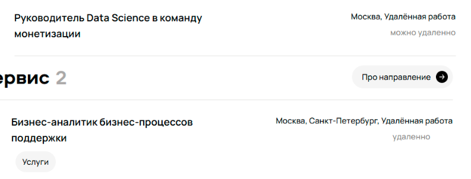

# Обнаруженные на странице карьерного сайта Авито баги

## Содержание
- [Вывод "Ничего не нашлось" в качестве релевантной вакансии](#вывод-ничего-не-нашлось-в-качестве-релевантной-вакансии)
- [Фильтр по городу не применяется на отображаемые вакансии](#фильтр-по-городу-не-применяется-на-отображаемые-вакансии)
- [Разделение логики фильтрации направлений на два интерфейса](#разделение-логики-фильтрации-направлений-на-два-интерфейса)
- [Отсутствие информации о месте и формате работы в вакансии](#отсутствие-информации-о-месте-и-формате-работы-в-вакансии)
- [Не соответствующий названию фильтра вывод в пустом дропдауне "Команда"](#не-соответствующий-названию-фильтра-вывод-в-пустом-дропдауне-команда)
- [Отсутствие выравнивания информации о местах и формате работы](#отсутствие-выравнивания-информации-о-местах-и-формате-работы)
- [Разный дизайн кнопки "Про направление"](#разный-дизайн-кнопки-про-направление)
- [Отсутствие согласования окончания слова "вакансия" и числа открытых вакансий](#отсутствие-согласования-окончания-слова-вакансия-и-числа-открытых-вакансий)

## Вывод "Ничего не нашлось" в качестве релевантной вакансии
### Фактический результат
В разделе "Клиентский сервис" один результат соответствует подходящей вакансии, второй содержит информацию о том, что "Ничего не нашлось", отображающийся, как полноценная вакансия.

### Ожидаемый результат
В списке подходящих вакансий содержатся исключительно существующие предложения. В случае, если по конкретному направлению их нет - оно не отображается как доступное для выбора в соответствующем фильтре.

### Приоритет
Логический дефект, приоритет **high**: пользователь получает ложное представление о числе вакансий и направлений, что снижает доверие к продукту.

---

## Фильтр по городу не применяется на отображаемые вакансии
### Фактический результат
При выбранном городе Санкт-Петербург в подходящих вакансиях содержатся те, что не содержат его в качестве места работы. Так, в направлении "Финансы, закупки и аудит" отображена вакансия без возможности удалённой работы и офисом в Москве.

### Ожидаемый результат
Вывод вакансий, соответствующих выбранным пользователям фильтрам "Город" и "Возможность удалённой работы": в случае, если вакансия не содержит выбранных городов, но соискатель рассматривает возможность удалённо работы, вакансии в других городах с возможностью удалённой работы следует отображать

### Приоритет
Функциональная ошибка, приоритет - **high**: фильтр по городу фактически не работает. Наблюдаемый баг усложняет взаимодействие соискателей с сайтом и не реализует определяемую названием фильтра логику.фильтр по городу фактически не работает, это критическая ошибка.

---

## Разделение логики фильтрации направлений на два интерфейса
### Фактический результат
При выбранном направлении "Data Science" ниже есть ещё фильтры "Поддержка пользователей", "Аналитик", которые переключают направление и разделяют один и тот же функционал с первичным фильтром.

### Ожидаемый результат
Возможность выбора одного или нескольких направлений в дропдауне "Направление" (на скриншоте "Data Science") без отображения избыточного функционала.

### Приоритет
Дефект UX, приоритет - **medium**: обнаруженный баг не ломает функциональность, но создаёт путаницу. Без возможности потыкать данный фильтр самостоятельно я и сейчас не могу определить, есть ли смысл у такого интерфейса: если это множественный выбор специализации, почему только одна из категорий выделена чёрным, при этом в значении фильтра указана только специализация "Data Science"?

---

## Отсутствие информации о месте и формате работы в вакансии
### Фактический результат
В разделе "Аналитика данных" вакансия "Аналитик данных в бизнес-команду Авито Авто" не содержит информацию о формате и доступных офисах, при этом пометка "офис" присутствует.

### Ожидаемый результат
Список городов и информация об удалённом формате работы для вакансии.

### Приоритет
UX-баг, с приоритетом, более близким к **medium**: отсутствие информации о месте работы способно вызывать у соискателя непонимание и нежелание рассмотреть конкретную вакансию. Пользователь не располагает возможностью определить, совпадает ли его место проживание и отношение к удалённому формату работу с доступным предложением, что может негативно сказаться на просмотрах отдельной вакансии.

---

## Не соответствующий названию фильтра вывод в пустом дропдауне "Команда"
### Фактический результат
Пустой раскрывающийся список фильтра "Команда" содержит текст "Вакансий пока нет"

### Ожидаемый результат
При отсутствии доступных команд отображается сообщение, соответствующее смыслу фильтра, например: "Нет доступных команд". При наличии таковых - список этих команд.

### Приоритет
Логический баг/баг UX с приоритетом, более близким к **low**: пользователь поймёт, что доступных к выбору опций нет, однако несоответствие названий нарушает консистентность сайта и может ввести пользователей в заблуждение.

---

## Отсутствие выравнивания информации о местах и формате работы 
### Фактический результат
Информация о городах и возможности удалённой работы выровнена по-разному: не во всех случаях выравнивание по правому краю (предположительно, это правильный вариант, т.к. вакансий с таким форматом большинство).

### Ожидаемый результат
Информация о городах и возможности удалённой работы выровнена единственным способом.

### Приоритет
UX-баг, с приоритетом, более близким к **low**: на пользовательский опыт такое выравнивание влияет минимально, однако нарушает дизайн.

---

## Разный дизайн кнопки "Про направление"
### Фактический результат
Одна из кнопок "Про направление" (в категории "Аналитика данных") отличается от других отсутствием стрелки в выделенном чёрном круге.

### Ожидаемый результат
Совпадающий дизайн кнопки.

### Приоритет
UX-баг, приоритет - **low**: на пользовательский опыт такой дефект не влияет, однако нарушает единство дизайна.

---

## Отсутствие согласования окончания слова "вакансия" и числа открытых вакансий
### Фактический результат
Информация о доступных вакансиях содержит текст "227 вакансии открыто".

### Ожидаемый результат
Окончание слова "вакансия" должно быть согласовано с числом 227: "227 вакансий открыто".

### Приоритет
UX-баг, приоритет - **low**: на пользовательский опыт такой дефект не влияет, однако нарушает правила языка.